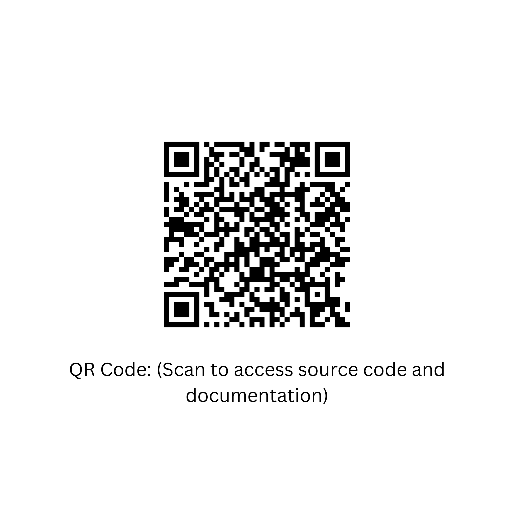
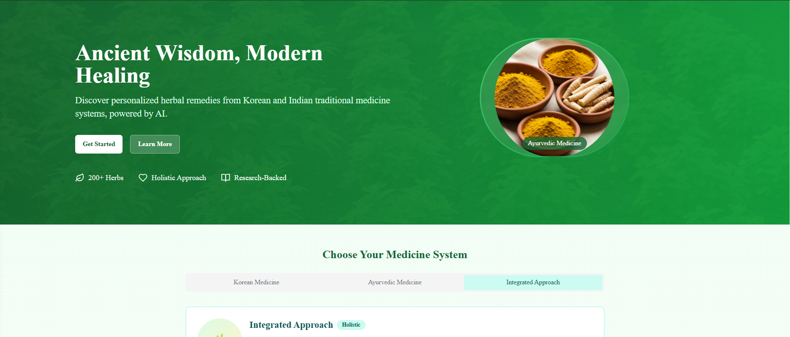
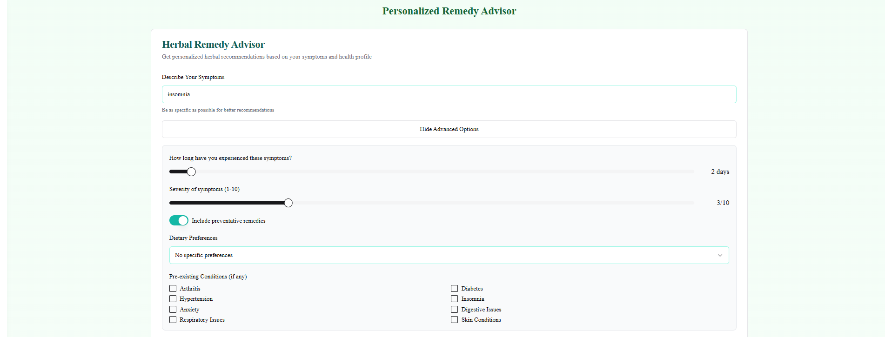
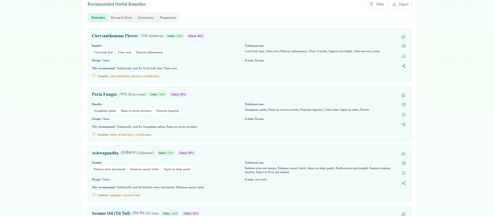
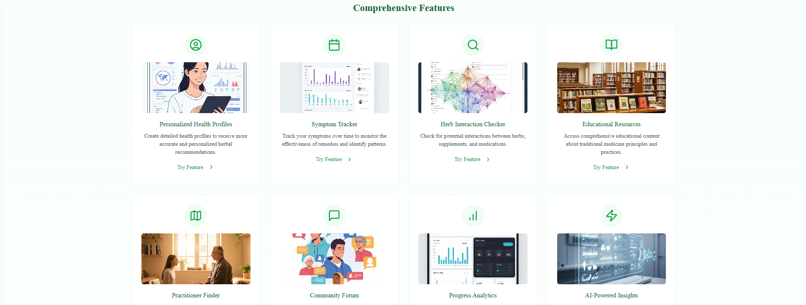
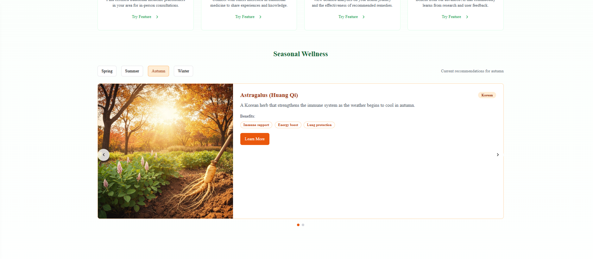

# 🌿 Indo-Korean Traditional Medicine Advisor

An AI-powered wellness platform that combines **Traditional Korean Medicine** and **Ayurvedic Medicine** to provide safe, personalized herbal health recommendations.

---

## 🧠 What Is This Project?

**Indo-Korean Traditional Medicine Advisor** is a web application that helps users understand traditional herbal medicine in a **modern, safe, and personalized way**.

It bridges **ancient healing knowledge** with **modern AI and web technology** so users can:

- Learn about traditional medicine  
- Get personalized herbal suggestions  
- Track their health progress  
- Avoid unsafe herb–medicine combinations  

---

## 🚀 Live Demo & Access

### 📱 Try the App (Scan QR Code)
Scan the QR code below to access the application code and documentation:

  

---

### 🎥 Watch Demo Video

Click below to watch the full working demo of the project:

  

---

## 🎯 Why I Built This Project

Traditional medicine is widely used, but:

- People often don’t know which herbs are safe  
- Herb–medicine interactions can be dangerous  
- Reliable knowledge is scattered and hard to understand  
- There is no easy way to track progress over time  

I built this project to:

- Make traditional medicine accessible and understandable  
- Combine Korean and Indian healing systems  
- Put safety first  
- Show how technology can support holistic healthcare  

---

## ⚙️ What This Project Does

In simple terms, the app allows users to:

### 1. Choose a Medicine System
- Korean Medicine  
- Ayurvedic Medicine  
- Integrated approach  

### 2. Create a Personal Health Profile
- Medical conditions  
- Medications  
- Allergies  
- Dietary preferences  

### 3. Track Symptoms
- Log symptoms with date and severity  
- View symptom history and trends  

### 4. Get AI-Based Herbal Recommendations
- Based on symptoms and health data  
- Includes preparation, dosage, and benefits  

### 5. Check Herb Safety
- Detect herb–herb interactions  
- Detect herb–medicine interactions  
- Warn about allergies and risks  

### 6. Learn
- Educational content about herbs  
- Traditional medicine systems and principles  

### 7. Find Practitioners
- Search for traditional medicine doctors (mock data)  

### 8. Track Progress
- Visual charts showing health improvement over time  

### 9. Get Seasonal Wellness Tips
- Recommendations change based on the season  

---

## ✨ Key Features

- ✅ Dual Medicine System (Korean + Ayurvedic)  
- ✅ Personalized Health Profiles  
- ✅ Symptom Tracking with History  
- ✅ AI-Powered Herbal Recommendations  
- ✅ Herb & Medication Safety Checker  
- ✅ Educational Knowledge Hub  
- ✅ Practitioner Finder  
- ✅ Community Forum (discussion-based)  
- ✅ Progress Analytics Dashboard  
- ✅ Seasonal Wellness Recommendations  
- ✅ Responsive Design (mobile, tablet, desktop)  
- ✅ Smooth animations and modern UI  
- ✅ 3D herb visualization  

---

## 🖼️ Screenshots

### 🏠 Home Page

### 🩺 Symptom Tracker

### 🤖 AI Recommendations

### ✨ Features Overview

### 🌿 Seasonal Wellness

---

## How to Run the Project
# Clone the repository
git clone <your-repo-url>

#Go to project folder
cd indo-korean-medicine-advisor

# Install dependencies
npm install

# Start development server
npm run dev

Then open:
👉 http://localhost:3000

---

## 📁 Documentation

For detailed technical information, see:

- **PROJECT_OVERVIEW.md** – Full feature explanation  
- **IMPLEMENTATION_SUMMARY.md** – What was built and how  
- **TECH_STACK.md** – Architecture and technologies  
- **QUICK_SUMMARY.md** – One-page project overview  

---

## 🔮 Future Improvements

Planned enhancements for future versions:

- User authentication  
- Real database integration  
- Advanced AI/ML backend  
- Mobile app version  
- Multilingual support (Korean, Hindi, English)  
- Practitioner onboarding  
- Telemedicine features  

---

## 🧩 Project Status

**✅ Complete & Fully Functional**  
Ready for demonstration, learning, or further development.

---

## 💚 Final Note

This project represents my interest in:

- Health technology  
- AI-powered applications  
- Full-stack development  
- Solving real-world problems using software  

Thank you for checking it out 🌱  
Feel free to explore, learn, or build on top of it.

